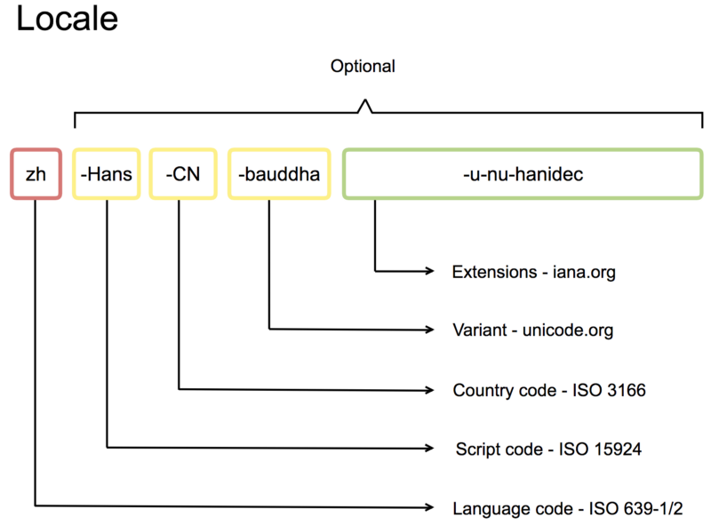

# Introduction to the localization topic

## Why should we bother to localize content of our product?
The answer is simple - by translating the content of our project (text, fonts, textures, sounds, voices, movies, ect.) we're maximizing its recipents.

------
## Basic concepts
The two basic concepts one will learn at the very beginning of diving into localization topic are: localization and internationalization. Those are terms for two distinct things.

### Internationalization (I18N)
**Internationalization** is the process of designing a software application so that it can be adapted to various languages and regions without engineering changes.
It is ideally performed only once, as an integral part of ongoing development of software infrastructure and tools.

### Localization (L10N)
**Localization** is the process of adapting internationalized software for a specific region or language by translating text and adding locale-specific components.
It is potentially performed multiple times, for different locales, and uses the infrastructure and tools provided by internationalization.

### Locale
An important aspect of I18N is the **locale**. It is a set of parameters that defines the user's language, region and any special variant preferences that the user wants to see in their user interface. Those settings usually include the following display format settings:
- number format setting
- character classification, case conversion setting
- date-time format setting
- string collation setting
- currency format setting
- paper size setting
- color setting

Usually a locale identifier consists of at least a language code and a country/region code. Following diagram names each possible part of locale code:

------
## Unreal Engine localization system
UE localization system is wrapped around the `FText` data type capable of storing the localization information. For internationalization support Unreal Engine uses [International Components for Unicode](https://icu.unicode.org/) (ICU) library.

### Cultures
Cultures in UE4 contain internationalization information for a particular locale. Culture names are composed of three hyphen-separated parts (an IETF language tag):
- A two-letter ISO 639-1 language code (such as "zh").
- An optional four-letter ISO 15924 script code (such as "Hans").
- An optional two-letter ISO 3166-1 country code (such as "CN").

When UE4 looks for localization data for a particular culture, it processes them from most to least specific. For example:
- zh-Hans-CN is processed as "zh-Hans-CN", then "zh-CN", then "zh-Hans", then "zh".
- en-GB is processed as "en-GB", then "en".

In order to achieve the widest coverage for a particular culture, use the least specific culture code that is valid. Usually that is just the language code, but you should be aware of regional language variations that need to be considered.

------
Sources:
- https://docs.unrealengine.com/4.26/en-US/ProductionPipelines/Localization/Overview/
- https://www.youtube.com/watch?v=6xRw6IWg_fY&list=PLh0J3NckZPo-RM_TKeWM5WZIyHlaLy2zY
- https://en.wikipedia.org/wiki/Internationalization_and_localization
- https://en.wikipedia.org/wiki/Locale_(computer_software)

---
Next: [Localization Dashboard quick start](../2_LocalizationDashboard/Localization-Dashboard-Quick-Start.md)