# Localization Dashboard overview
On this page you can find broader explanation of the Localization Dashboard itself and its elements. If you need just a quick guide for setting up localization in your project, see the page [Setting up localization for your project](Setting-up-localization-for-your-project).

---
## What is the Localization Dashboard?
The Localization Dashboard is a dedicated tool window, where you can mange manage settings of localization targets that your project uses.

Localization Dashboard window consists of two parts: 
- a left-side column **(A)**, where you can create, delete and manage globally all existing localization targers
- a right-side column **(B)**, where you can edit settings of the selected localization targets.

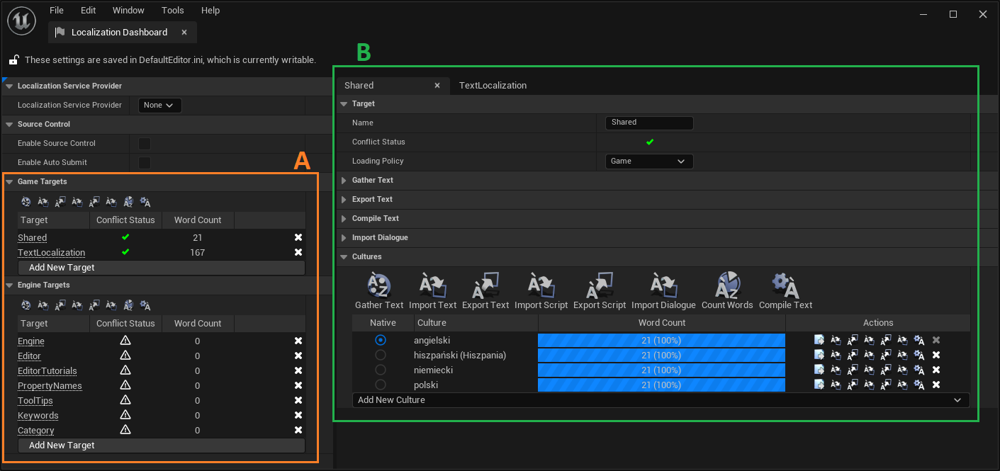

---
## Adding a new localization target
If your project needs localization, you will have to create a new localization target that enable you to gather localizable texts and manage their translations. You can choose between two separate categories of localization targets: **game** targets and **editor** ones. Generally there's no difference between them, however you should rather go with the game category for clarity.

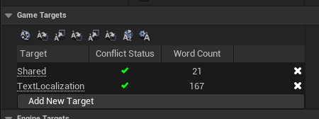

In order to add a new localization target to the project, you need to click on the `Add New Target` button at the bottom of targets section. This will add a new entry in the list of existing targets. You can have a few separated localization targets at the same time. It's up to you whether you want to put all game localizable content in one localization target or keep each game module in a separate targets.

In this section you can also perform a bulk operations on all existing localization targets. You can execute them by using buttons above the list with targets.

---
## Target settings
In this section you can change localization target name and its loading policy.

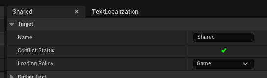

Loading policy determines when that specific localization target should be used. Available options here are: *Never*, *Always*, *Editor*, *Game*, *Property Names* and *Tooltips*. From the game project perspective you can go either with *Always* or *Game*.

---
## Gather texts
This section contains various settings for the text gatherer program. This program searches all specified locations with text files and packages in order to collect all localizable texts. All collected texts, along with some localization related data, are then stored inside a `[localization_target_name].manifest` file, that you can find inside *Content/Localization/[localization_target_name]* folder. The `*.manifest` file is a json file with some custom formatting, that can be read by Unreal class `FTextLocalizationResourceGenerator`.

<p>
<details>
<summary>Click here to see an example *.manifest file (Content/Localization/Shared/Shared.manifest).</summary>
<pre><code>
{
	"FormatVersion": 1,
	"Namespace": "",
	"Children": [
		{
			"Source":
			{
				"Text": "Unreal Localization Tutorial"
			},
			"Keys": [
				{
					"Key": "project_displayed_title",
					"Path": "Config/DefaultGame.ini(5)"
				}
			]
		},
		{
			"Source":
			{
				"Text": "Unreal Localization Tutorial - debug"
			},
			"Keys": [
				{
					"Key": "project_debug_title",
					"Path": "Config/DefaultGame.ini(6)"
				}
			]
		}
	],
	"Subnamespaces": [
		{
			"Namespace": "ST_CommonWords",
			"Children": [
				{
					"Source":
					{
						"Text": "Back to Main Menu"
					},
					"Keys": [
						{
							"Key": "button_back_to_main_menu",
							"Path": "/Game/Shared/Resources/ST_CommonWords.ST_CommonWords"
						}
					]
				},
				{
					"Source":
					{
						"Text": "Click on culture button to change active culture to selected one"
					},
					"Keys": [
						{
							"Key": "culture_switcher_manual",
							"Path": "/Game/Shared/Resources/ST_CommonWords.ST_CommonWords"
						}
					]
				},
				{
					"Source":
					{
						"Text": "Main Menu"
					},
					"Keys": [
						{
							"Key": "title_main_menu",
							"Path": "/Game/Shared/Resources/ST_CommonWords.ST_CommonWords"
						}
					]
				},
				{
					"Source":
					{
						"Text": "Quit"
					},
					"Keys": [
						{
							"Key": "button_quit",
							"Path": "/Game/Shared/Resources/ST_CommonWords.ST_CommonWords"
						}
					]
				},
				{
					"Source":
					{
						"Text": "Unreal Localization Tutorial"
					},
					"Keys": [
						{
							"Key": "title_unreal_localization_tutorial",
							"Path": "/Game/Shared/Resources/ST_CommonWords.ST_CommonWords"
						}
					]
				}
			]
		}
	]
}
</code></pre>
</details></p>

### Gather from Text Files


In case of Text Files, the Text Gatherer program will be searching for all uses of the localization macros (we're talking about `LOCTEXT` and `LOCTABLE` macro families) - and **ONLY** those macros. If you use directly `FStringTableRegistry::Internal_LocTableFromFile` function for creating CSV-based String Tables, **those function calls won't be recognized, therefore texts from those Sting Tables won't be gathered**.

`Search Directories` - here you can specify in which directories Text Gatherer should look for localizable texts. You can also specify which directories should be excluded from search in `Exclude Path Wildcards` setting. In `File Extensions` section contains all file types, that should be analysed - `*.h`, `*.cpp` and `*.ini` extensions are listed here as default ones.

### Gather from Packages

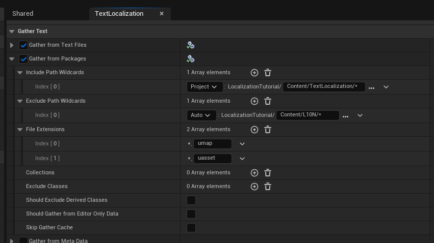

In case of gathering texts from packages, the Text Gatherer will be searching all FText properies with text content set to localizable.

As you can see, this section is similar to the previous one for Text Files, but contains some asset-related options. In most cases you don't need to edit any settings other than `Include Path Wildcards` (aka `Search Directories` from previous section) and `Exclude Path Wildcards`. In `File Extensions` setting the default file types are: `*.umap` and `*.uasset`.

---
## Export Text
This section is dedicated for settings used when you export gathered text data to a PO file. You don't need to change anything here. In fact, you might never use this export text option.

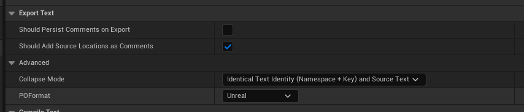

---
## Compile Text
Here you can find some checkboxes for enabling/disabling additional logic used during compiling text data into localization binaries. All three properties have self-explanatory tooltips. You can leave here default values.

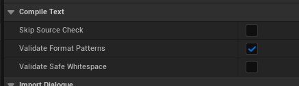

---
## Import Dialogue
This section is dedicated for setting up localization for dialogue audio files. The localizing dialogues topis is covered in page [Localizing Dialogues](../6_LocalizingDialogues/Localizing-Dialogues-in-Unreal.md).

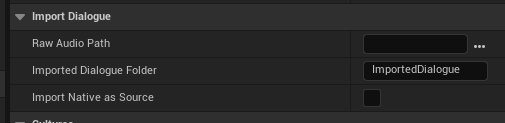

---
## Cultures
Along with Text Gatherer settings, this section is the most important and useful part of the Localization Dashboard, as here you can specify which cultures will be used in your project; update texts translations and compile localization data.

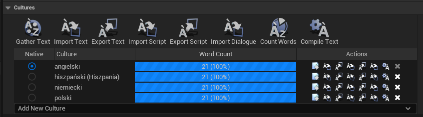

### Adding new Culture
This is simple and straightforward - click the `Add New Culture` button, and then select desired Culture from the dropdown list that will appear. Notice that you can choose a Culture not only from the main languages, but also from a specific dialects from a certain language family.

### Gathering Texts and creating text localization binaries
When you're happy with your choices of Cultures, it's time to prepare text for translations. The general approach is to gather texts, translate them and then compile all text data into localization binaries. You can performed each step by using appropriate option button visible above the list of used Cultures.

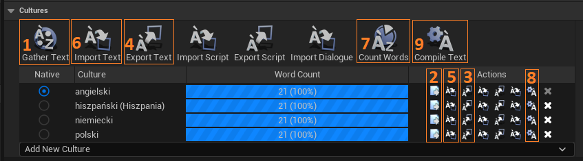

1. Firstly, you need to gather all localizable texts from your project. In order to do that, click `Gather text` option button **(1)**. This will list all localizable texts and create a bunch of custom JSON files: a described earlier `[localization_target_name].manifest` file + one `[localization_target_name].archive` file with text translations per each Culture.

<p>
<details>
<summary>Click here to see an example *.archive file (Content/Localization/Shared/de/Shared.archive for German).</summary>
<pre><code>
{
	"FormatVersion": 2,
	"Namespace": "",
	"Children": [
		{
			"Source":
			{
				"Text": "Unreal Localization Tutorial"
			},
			"Translation":
			{
				"Text": "Unreal Lokalisierung Tutorial"
			},
			"Key": "project_displayed_title"
		},
		{
			"Source":
			{
				"Text": "Unreal Localization Tutorial - debug"
			},
			"Translation":
			{
				"Text": "Unreal Lokalisierung Tutorial - debug"
			},
			"Key": "project_debug_title"
		}
	],
	"Subnamespaces": [
		{
			"Namespace": "ST_CommonWords",
			"Children": [
				{
					"Source":
					{
						"Text": "Back to Main Menu"
					},
					"Translation":
					{
						"Text": "Zurück zum Hauptmenü"
					},
					"Key": "button_back_to_main_menu"
				},
				{
					"Source":
					{
						"Text": "Click on culture button to change active culture to selected one"
					},
					"Translation":
					{
						"Text": "Klicken Sie auf die Schaltfläche Kultur, um die aktive Kultur in die ausgewählte Kultur zu ändern"
					},
					"Key": "culture_switcher_manual"
				},
				{
					"Source":
					{
						"Text": "Main Menu"
					},
					"Translation":
					{
						"Text": "Hauptmenü"
					},
					"Key": "title_main_menu"
				},
				{
					"Source":
					{
						"Text": "Quit"
					},
					"Translation":
					{
						"Text": "Beenden"
					},
					"Key": "button_quit"
				},
				{
					"Source":
					{
						"Text": "Unreal Localization Tutorial"
					},
					"Translation":
					{
						"Text": "Unreal Lokalisierung Tutorial"
					},
					"Key": "title_unreal_localization_tutorial"
				}
			]
		}
	]
}
</code></pre>
</details>
</p>

2. Now you should prepare text translations for each Culture your project use. You can do it either insinde Unreal or in external software.

   1. If you want to do it inside Unreal, you can edit translation in Tranlation Editor window, that you can open by clicking left-most option available per each Culture **(2)**. In that window you can edit translation for each manually, as well as inspect text context and history. Note, that from that window you can use export/import PO files options as well (these are described in the next point). 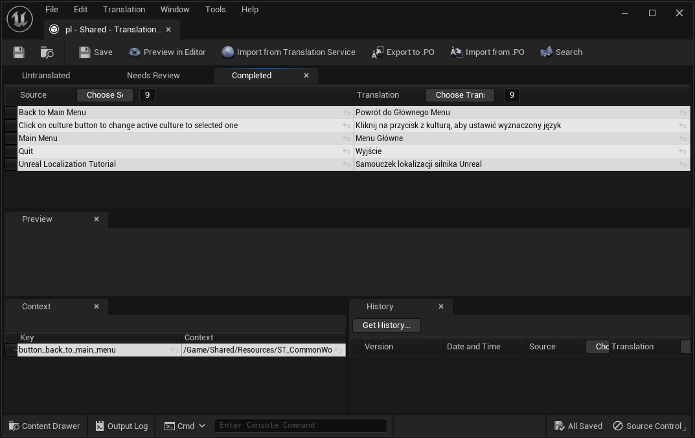

   2. In order to prepare translations in external software, you need to export texts data. Unreal provides an option to export those data to PO files. You can do that by clicking export text option separately per each Culture **(3)**, or for all Cultures at the same time **(4)**. This will create a `[localization_target_name].po` file that contains information about translations for each text listed in `*.archive` file for a specific Culture. `*.PO` file type is the standard for working with translations. You can edit this with either commercial software or the free one like [poedit](https://poedit.net/).
   When all translations will be finished, you can import them back to the Unreal by using analogical options: **(5)** per each Culture or **(6)** for all of them.

3. Final step is to compile text translations into localization binaries. Before that you can use `Count Words` option **(7)** to make sure all texts have been translated. When you're ready, simply use `Compile Text` option available per each culture **(8)** separately, or for all of them at once **(9)**.

That's it - your text translations are loaded into project! One last thing is to tell the Unreal, what localization binaries should be packed with your project build.

---
## Packaging localization data
Localization data isn't attached to the build by defauls; **you need to add them manually**.

Go to the *Project Settings/Packaging/Localizations to Package* options. In advanced options set, find the `Localizations to Package` section. Here you can specify what localizations data will be added to your project packages during build. To make things easier, you can narrow the available options to only existing localization by selecting `Show Localized` toggle.

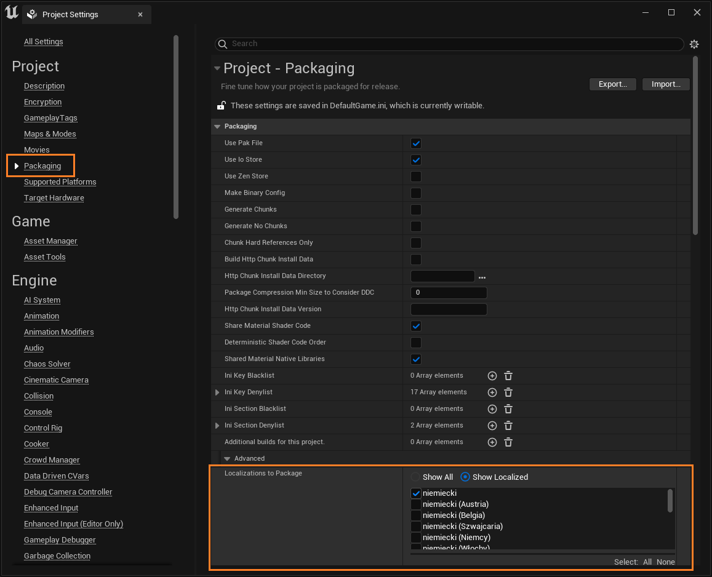

The list of packaged localizations can be also edited directly in `DefaultGame.ini` file. In order to add specific cultures to staging use `+CulturesToStage=` command under `ProjectPackagingSettings` category:

```ini
[/Script/UnrealEd.ProjectPackagingSettings]
...
+CulturesToStage=en
+CulturesToStage=es
+CulturesToStage=de
+CulturesToStage=pl
```

---
Source:
- [Unreal doccumention](https://docs.unrealengine.com/4.26/en-US/ProductionPipelines/Localization/LocalizationTools/)
- [Unreal Engine Localization Dashboard](https://www.youtube.com/watch?v=c8XDjTcE9DY&list=PLh0J3NckZPo-RM_TKeWM5WZIyHlaLy2zY&index=3) by Unreal Gems
- [Unreal Engine Localization Packaging Settings](https://www.youtube.com/watch?v=HJgzqzTz6hw&list=PLh0J3NckZPo-RM_TKeWM5WZIyHlaLy2zY&index=10) by Unreal Gems
- https://poedit.net/

---
Prev: [Setting up localizable texts in Unreal](../3_SettingUpLocalizableTexts/Setting-up-localizable-texts-in-Unreal.md)

Next: [Setting up texts localization for your project](../2_LocalizationDashboard/Setting-up-texts-localization-for-your-project.md)