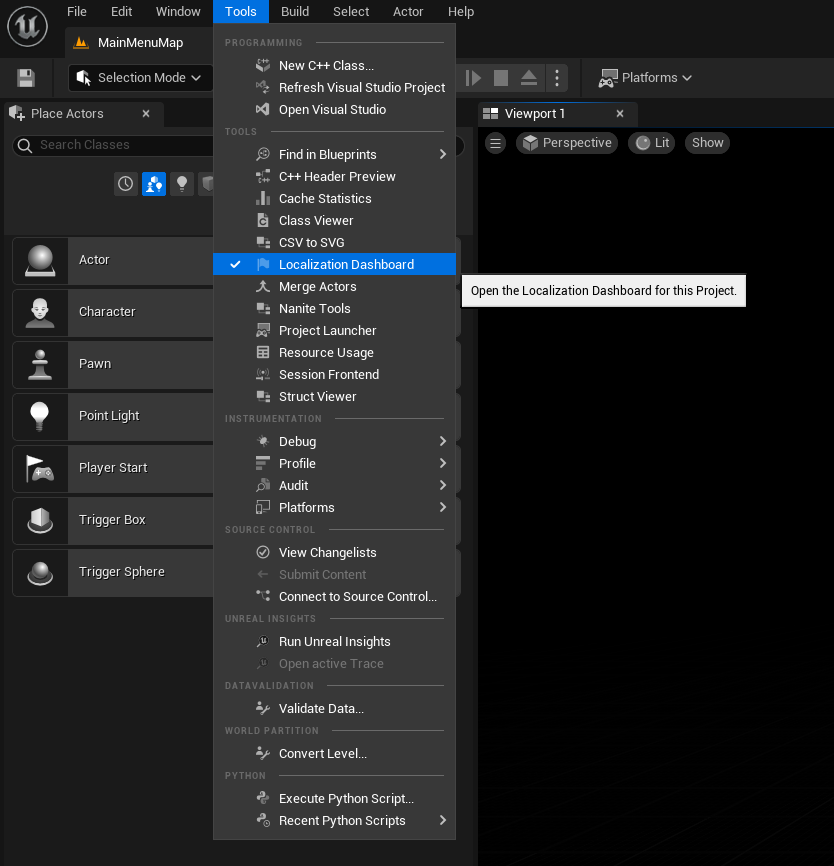
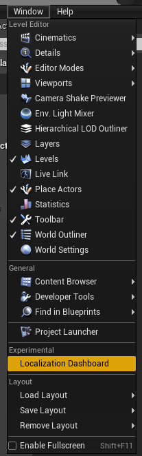
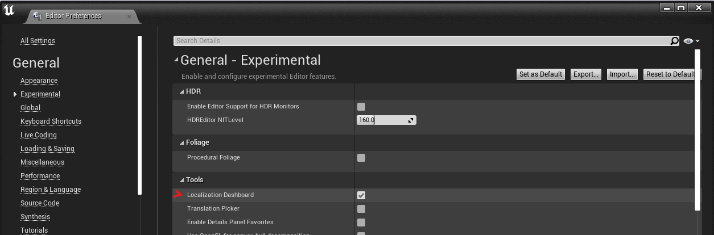

# Localization Dashboard quick start
On this page you can find some basic knowledge about Localization Dashboard itself and how to access it.
For broader explanation see page [Localization Dashboard overview](Localization-Dashboard-Overview.md).
If you need just a quick guide for setting up localization in your project, see the page [Setting up localization for your project](Setting-up-texts-localization-for-your-project.md).

## What is Localization Dashboard
The Localization Dashboard in Unreal Engine is a tool that helps you managing localization targets of your project. It is awailable both for UE4 and UE5. Despite being still marked as experimental, it is the recommended way to manage Localization Targets.

## Accessing Localization Dashboard
In UE5, the Localization Dashboard window can be opened from **Tools** menu:

In UE4 the Localization Dashboard window can be accessed via **Window>(Experimental) Localization Dashboard** option:

In case this option isn't visible for you, make sure you have got enabled it in editor settings under **General>Experimental>Tools** category:

---
Sources:
- https://docs.unrealengine.com/4.26/en-US/ProductionPipelines/Localization/LocalizationTools/

---
Prev: [Introduction to the localization](../1_Introduction/Introduction-to-the-localization.md)

Next: [Localization Dashboard overview](../2_LocalizationDashboard/Localization-Dashboard-Overview.md)