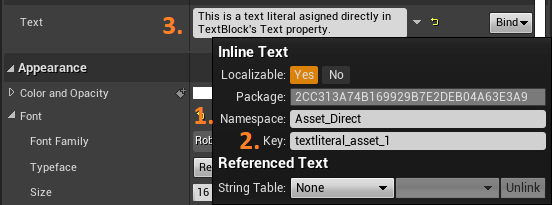
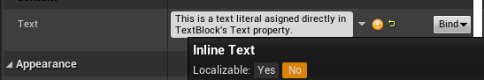

# Basics of text localization in Unreal

## Unreal tools for text localization
Unreal has three data types dedicated for strings: `FString`, `FName` and `FText`. I won't be covering them in details here (see: [String Handling in Unreal Engine](https://docs.unrealengine.com/4.26/en-US/ProgrammingAndScripting/ProgrammingWithCPP/UnrealArchitecture/StringHandling/)). From our point of view the most important is the fact that `FText` is the only data structure, that is capable of handling text localization. In fact, the whole localization system in Unreal is wrapped around that data type.
For all user-facing texts you should use `FText`. It's better to get accustomed to this data type as early as possible, rather than refactoring tons of code in your project.

`FText` property editor provides you the possibility to set up all three components of a localizable text: a **namespace**, a **key** (helps to identify the text) and a **source string** (the text you want to be translated).

---
### Non-localizable texts
In case you don't want some text to be translated, then you can mark given `FText` as non-localizable. You can do this either in editor or in code via the `FText::AsCultureInvariant()` method or `INVTEXT` macro.

---
## How to prepare text for localization
As you've read earlier, a localizable text is composed from a namespace, a key and a source string. Setting those is easy, but also it can be easily done in the wrong way.

It's important to know that source string text format matters A LOT. It's beacause different languages have different grammar and words order rules. And those can easily break the localization.

Generally, the most important rules of thumb are the following:
- **don't concatenate strings** - this breaks grammar rules of some languages and therefore invalidates its translations
- **do use** `FormatText` **methods** - they are specifically made for dealing with differences in languages grammar

I won't be going deeper in details here, but here are the links that covers this topic thoroughly:
- [Text formatting overview in Unreal docummentation](https://docs.unrealengine.com/4.26/en-US/ProductionPipelines/Localization/Formatting/)
- [BenUI post about setting up localization in Unreal](https://benui.ca/unreal/ui-localization/#dont-break-localization)
- [Unicode standard for Language Plural Rules](https://www.unicode.org/cldr/cldr-aux/charts/29/supplemental/language_plural_rules.html)

---
Prev: [Introduction to the localization topic](1_Introduction/Introduction-to-the-localization.md)

Next: [Setting up localizable texts in Unreal](3_SettingUpLocalizableTexts/Setting-up-localizable-texts-in-Unreal.md)