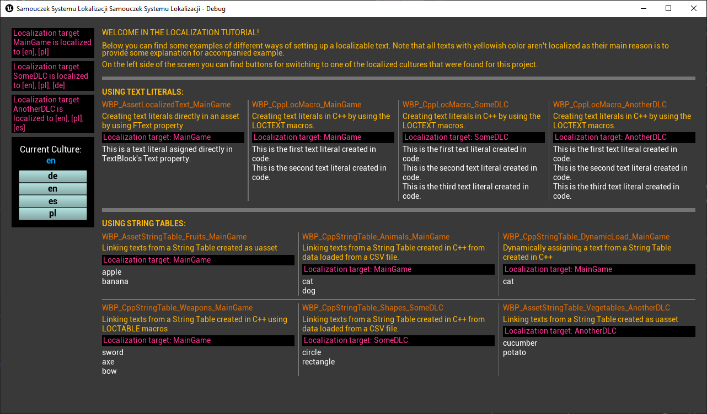
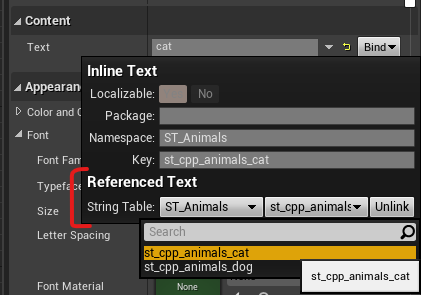

# Setting up localizable texts in Unreal

On this page you can find descriptions of examples you can find in `LocalizationTutosial.uproject`.

### Accessing examples
When you open the project in Unreal editor, navigate to the *Content/TestScene* directory. There you can find `WBP_Test.uasset` widget, that contains all examples discussed in the following paragraphs. It's the start point for quick access to all of the examples.



Generally, there are two approaches of creating localizable texts - using **text literals** or using **string tables**.

---
## Text Literals
Using text literals means you create and at the same time assign a localizable text directly in a place that this text will be used.

---
### Creating Text Literals in Blueprints
You can set all 3 elements of localizable text in FText property window.


Examples: `WBP_AssetLocalizedText_MainGame.uasset` (*Content/MainGame*).

---
### Creating Text Literals in C++
In code you can create text literals using the `LOCTEXT` family of macros.
```C++
/**
* Define the namespace to use with LOCTEXT.
* This is only valid within a single file, and must be undefined before the end of the file.
*/
#define LOCTEXT_NAMESPACE "Cpp_Namespace_1"

void ULocMacroExampleWidget::FillAllTexts()
{
	if (IsValid(this->TextLiteral_1))
	{
		// Create a text literal within the namespace defined in line 16:
		this->TextLiteral_1->SetText(LOCTEXT("Cpp_TextLiteral_1", "This is the first text literal created in code."));
	}
	if (IsValid(this->TextLiteral_2))
	{
		// Create a text literal within a different namespace than the one defined in line 16:
		this->TextLiteral_2->SetText(NSLOCTEXT("Cpp_Namespace_2", "Cpp_TextLiteral_2", "This is the second text literal created in code."));
	}
}

// Undefine the namespace before the end of the file
#undef LOCTEXT_NAMESPACE
```
Examples:
- `LocMacroExampleWidget.cpp` (*Source/LocalizationTutorial/MainGame*);
- `LocMacroAnotherDLCExampleWidget.cpp` (*Source/LocalizationTutorial/AnotherDLC*).

---
### Creating Text Literals in INI files
Text literals can be created in INI files only by using `NSLOCTEXT` macro.
```C++
ProjectDisplayedTitle=NSLOCTEXT("[/Script/EngineSettings]", "ProjectDisplayedTitle", "Localization System Tutorial")
ProjectDebugTitleInfo=NSLOCTEXT("[/Script/EngineSettings]", "ProjectDebugTitleInfo", "Localization System Tutorial - Debug")
```
Examples: `DefaultGame.ini` in *Config* directory.

---
## String Tables
String Table let you to create a multiple units of localizable text, that are stored in one place and can be re-used across the whole project. It's truly a robust approach for preparing sets of localizable texts. You probably will be using this approach most of the time. You can learn more about [String Tables in the official documentation](https://docs.unrealengine.com/4.27/en-US/ProductionPipelines/Localization/StringTables/).

---
### Creating String Tables in Blueprints
Using the content browser (**Add>Miscellaneous>String Table**) you can create a String Table asset. In its editor window you can specify a **namespace** name for all of texts this table will be keeping. In order to add a new text you need to specify an unique text **key** and a **source text**. Keep in mind, that key cannot be changed after creating localizable text, so be sure how it should be named.

[string_table_editor_img]

Examples:
- `ST_Fruits.uasset` (*Content/MainGame*);
- `ST_Vegetables.uasset` (*Content/AnotherDLC*).

---
### Creating String Tables in C++
In order to create a String Table from code, you must use `LOCTABLE` family of macros.

```C++
LOCTABLE_NEW("ST_Weapons", "ST_Weapons");
LOCTABLE_SETSTRING("ST_Weapons", "st_cpp_weapons_sword", "sword");
LOCTABLE_SETMETA("ST_Weapons", "st_cpp_weapons_sword", "Comment", "This is a comment about sword");
LOCTABLE_SETSTRING("ST_Weapons", "st_cpp_weapons_axe", "axe");
LOCTABLE_SETMETA("ST_Weapons", "st_cpp_weapons_axe", "Comment", "This is a comment about axe");
LOCTABLE_SETSTRING("ST_Weapons", "st_cpp_weapons_bow", "bow");
LOCTABLE_SETMETA("ST_Weapons", "st_cpp_weapons_bow", "Comment", "This is a comment about bow");
```

Examples: `StringTableGeneratorMainGame.h` (*Source/LocalizationTutorial/MainGame*).

---
### Creating String Tables in C++ using CSV file
You can use `LOCTABLE_FROMFILE_X` macro to load a set of texts at once directly from a CSV file. 
```C++
LOCTABLE_FROMFILE_GAME("ST_Animals", "ST_Animals", "Localization/StringTablesCSV/ST_Animals.csv");
```
Examples: `CsvBaseStringTableLoaderMainGame.h` (*Source/LocalizationTutorial/MainGame*), `CsvBaseStringTableLoaderSomeDLC.h` (*Source/LocalizationTutorial/SomeDLC*).

**Remember** - in order for CSV file be properly parset, it should contain two mandatory columns: **"Key"** and **"SourceString"**.
```
"Key","SourceString","Comments"
"st_cpp_animals_cat","cat","This is a cat."
"st_cpp_animals_dog","dog","This is a dog."
```
Example CSV files: `ST_Animals.csv` and `ST_Shapes.csv` can be found in *Content/Localization/StringTablesCSV* directory.

---
### Referencing a String Table
Once you've created your String Table, you assign a text from this table either using FText editor or directly in code.

#### Referencing a String Table in editor


Examples:
- `WBP_AssetStringTable_Fruits_MainGame.uasset`, `WBP_CppStringTable_Animals_MainGame.uasset`, `WBP_CppStringTable_Weapons_MainGame.uasset` from *Content/MainGame* directory;
- `WBP_CppStringTable_Shapes_SomeDLC.uasset` from *Content/SomeDLC* directory;
- `WBP_AssetStringTable_Vegetables_AnotherDLC.uasset` from *Content/AnotherDLC* directory.

#### Referencing a String Table in C++
You can either use static `FText::FromStringTable` function or use `LOCTABLE` macro. The difference is that macro will only works with literals, while the function can accept variable arguments as well.
```C++
// Referencing a String Table using the static FText::FromStringTable function:
this->DynamicText->SetText(FText::FromStringTable("ST_Animals", "st_cpp_animals_cat"));

// Referencing a String Table using the LOCTABLE macro:
this->DynamicText->SetText(LOCTABLE("ST_Animals", "st_cpp_animals_cat"));
```

#### Referencing a String Table in INI files
In INI files you can only use `LOCTABLE` macro.

---
Prev: [Basics of text localization in Unreal](../2_TextLocalizationBasics/Basics-of-text-localization-in-Unreal.md)

Next: [Localization Dashboard overview](../4_LocalizationDashboard/Localization-Dashboard-Overview.md)