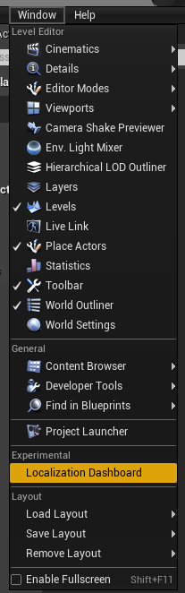
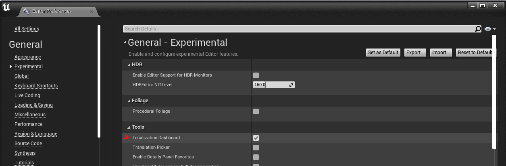
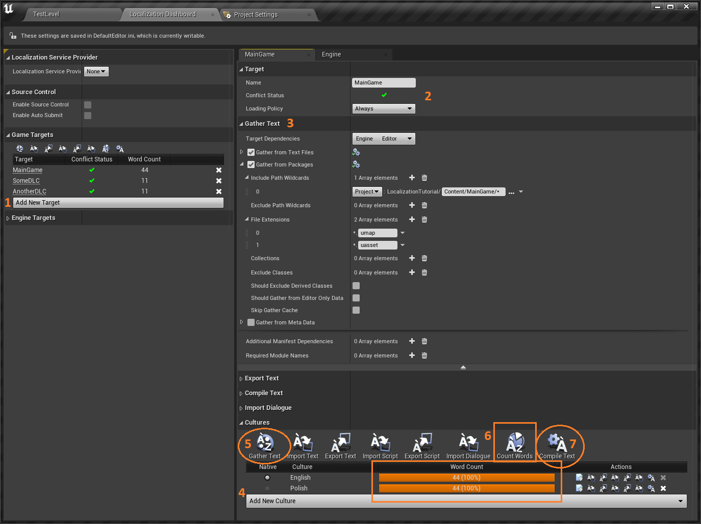
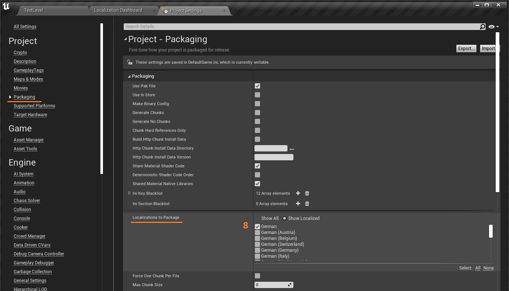

# Setting up texts localization for your project
This page contains a short, right-to-the-point guide for accessing Localization Dashboard window and setting up localization for your project. That said, you wan't find here a deeper explanation of what happens in each step. If you want to learn more about Localization Dashboard and its element, to the page [Localization Dashboard overview](Localization-Dashboard-Overview.md).

## Accessing Localization Dashboard window
You can open Localization Dashboard window from **Window>(Experimental) Localization Dashboard** option:

In case this option isn't visible for you, make sure you have got enabled it in editor settings under **General>Experimental>Tools** category:

---
## Setting up localization target step-by-step
Below you can find a brief and condensed list of steps for setting up localization in your project.

1. Create a new localization target
2. Set up target name and loading policy
3. Configure `Gather Text` settings for Text Files and Packages
4. Add call cultures that will be localized
5. Hit `Gather Text` button in *Cultures* section to collect all localizable texts
6. Provide translations for all texts in all cultures. You can use `Count Words` option to make sure you haven't miss anything.
7. Hit `Compile Text` button to create localization binary data
8. When localization binary data is ready, make sure that those binaries are packed to a build -> go to *Project Settings/Packaging/Localizations to Package* option and add all localized cultures that should be available in game
9. Done!

---
Prev: [Localization Dashboard overview](../4_LocalizationDashboard/Localization-Dashboard-Overview.md)

Next: [Localizing non-text assets in Unreal](../5_LocalizingNonTextAssets/Localizing-non-text-assets-in-Unreal.md)